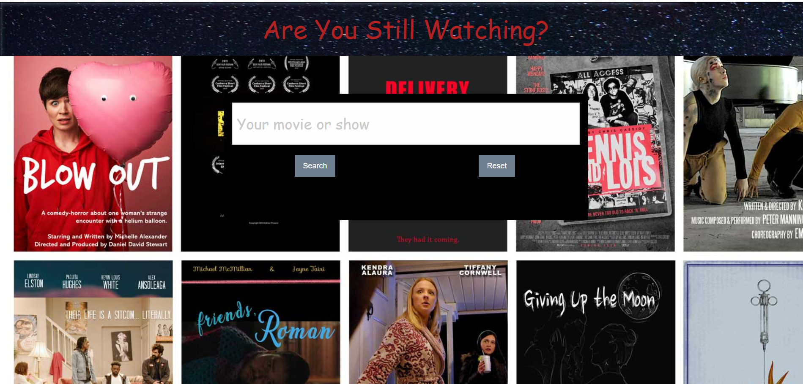

## Are You Still Watching?
> Are You Still Watching - A Television and Movie Scraper

## Table of contents
* [General info](#general-info)
* [Screenshots](#screenshots)
* [Setup](#setup)
* [Status](#status)
* [Contact](#contact)

## General info
This is a basic browser web-page that takes a user input from a search bar and uses that input to pull up streaming availability about a given show. The user will be returned with information regarding where the show can be streamed, how the show was received by critics, and  other pertinent information.

## Screenshots

## Setup
This program runs in browser. There is no installation needed.

## Code Examples
    ADD API CALL HERE.
## Status
Project is in progress. Feel free to email us  with any suggestions or to report any bugs: ianmharris93@gmail.com/MELVIN'S EMAIL/KANE'S EMAIL/KYLE'S EMAIL

## Contact
Created by Kyle Berner, Kane Cruz-Walker, Melvin Cerrillo, and Ian Harris(https://github.com/iannm93) - ianmharris93@gmail.com - feel free to contact us!

